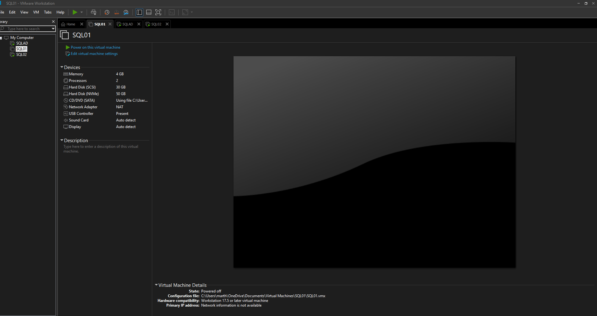
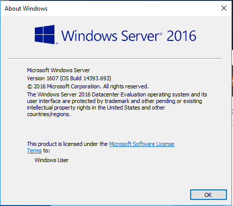
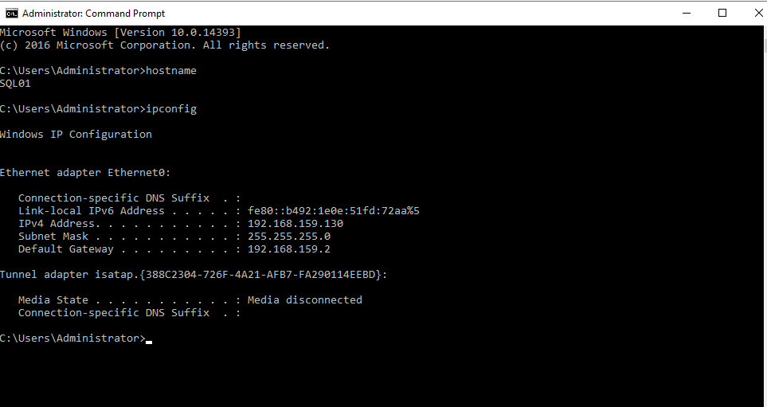

| Setting              | Value                          |
| -------------------- | ------------------------------ |
| Hypervisor           | VMware Workstation 17.5        |
| Operating System     | Windows Server 2016 Datacenter |
| RAM Allocated        | 4 GB                           |
| CPU                  | 2 vCPU                         |
| Disk 1 (Data – SCSI) | 30 GB                          |
| Disk 2 (OS – NVMe)   | 50 GB                          |
| Network Type         | NAT                            |
| Server Name          | SQL01                          |

Storage Layout Design

This lab uses two virtual disks to simulate production-style separation:

50 GB Disk (NVMe) → Operating System

30 GB Disk (SCSI) → SQL Server Data and Log files

Separating SQL data/log files from the operating system disk helps:

Improve performance

Reduce disk contention

Simplify backup and recovery

Follow production best practices

Screenshots
## VMware Hardware Configuration
Shows allocated RAM, CPU, storage disks, and NAT network configuration in VMware.

## Windows Server Version
Confirms Windows Server 2016 Datacenter installation and build version.

## Hostname & IP Configuration
Validates server name (SQL01) and confirms IPv4 address, subnet mask, and default gateway.

## Disk Layout
Displays OS disk and dedicated SQL data/log disk configuration using Disk Management.

