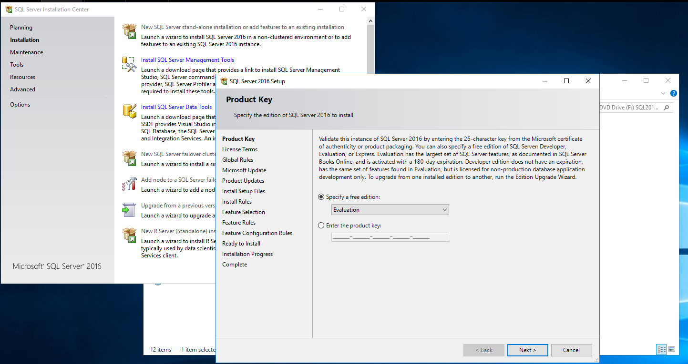
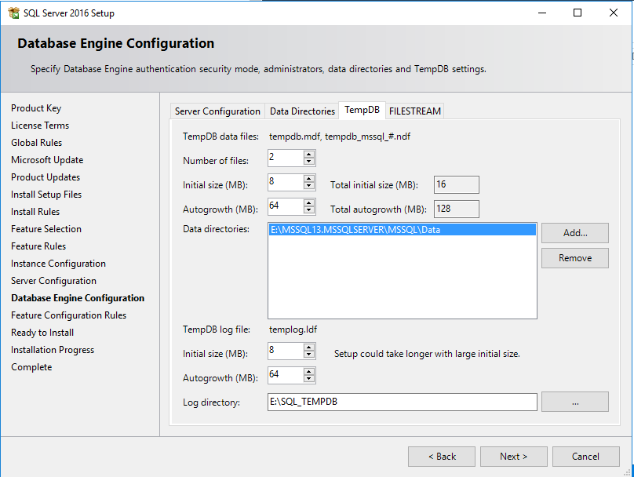
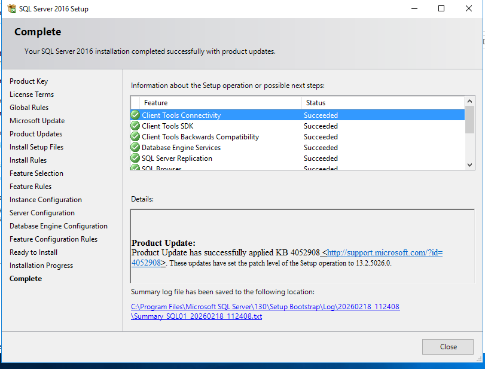

SQL Server 2016 Installation
Objective

Install SQL Server 2016 (Evaluation Edition) on Windows Server 2016 using best practice configuration for a DBA lab environment.

Installation Steps
1️⃣ Launch Installation Center
2️⃣ New Stand-Alone Installation

Selected:

Installation → New SQL Server stand-alone installation

Evaluation edition selected.

3️⃣ Feature Selection

Selected:

Database Engine Services

SQL Server Replication

Client Tools Connectivity

Client Tools SDK

4️⃣ Instance Configuration

Installed as:

Default Instance
Instance ID: MSSQLSERVER

5️⃣ Server Configuration

Configured services:

SQL Server Agent → Automatic

SQL Server Database Engine → Automatic

Instant File Initialization enabled

6️⃣ Database Engine Configuration

Configured:

Mixed Mode Authentication

Strong SA password set

Windows Administrator added as SQL admin

7️⃣ Installation Complete

Installation completed successfully with product updates applied.

Outcome

SQL Server 2016 successfully installed as the default instance on server SQL01.

## Installation Screenshots

### 1️⃣ Installation Center

---

### 2️⃣ New Stand-Alone Installation (Evaluation Edition)

---

### 3️⃣ Feature Selection

---

### 4️⃣ Default Instance Configuration

---

### 5️⃣ Server Configuration

---

### 6️⃣ Mixed Mode Configuration

---

### 7️⃣ Data Directories Configuration

---

### 8️⃣ TempDB Configuration

---

### 9️⃣ Installation Completed Successfully

