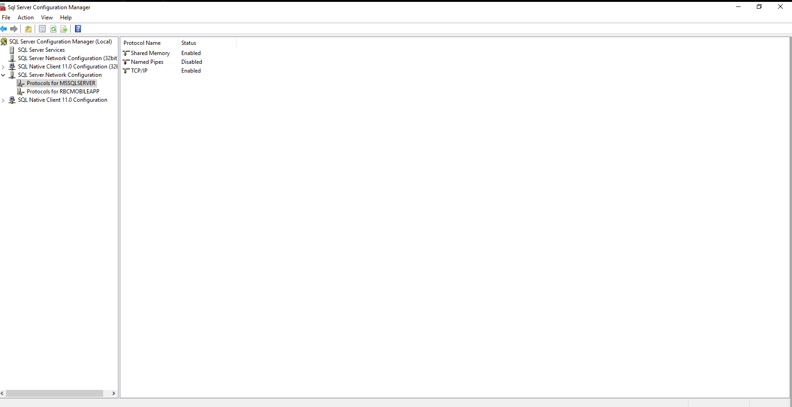

# 03 – Instance Configuration & Validation

## Objective

Validate SQL Server 2016 installation and configure critical instance-level settings following DBA best practices.

This phase includes:

* Verifying SQL Server version and edition
* Configuring max server memory
* Validating tempdb configuration
* Enabling TCP/IP connectivity
* Restarting SQL services

---

# 1️⃣ SQL Server Connection Verification

Connected to SQL Server instance using:

* Server Name: `SQL01`
* Authentication: Windows Authentication

Successful connection confirmed via Object Explorer.

```markdown

```

---

# 2️⃣ SQL Server Version & Edition Verification

Executed:

```sql
SELECT @@VERSION;

SELECT 
    SERVERPROPERTY('ProductVersion') AS ProductVersion,
    SERVERPROPERTY('Edition') AS Edition,
    SERVERPROPERTY('EngineEdition') AS EngineEdition;
```

Results Confirmed:

* Version: 13.0.5026.0 (SQL Server 2016 SP2)
* Edition: Enterprise Evaluation (64-bit)
* Engine Edition: 3

```markdown

```

---

# 3️⃣ Max Server Memory Configuration

VM Memory: 4 GB (4096 MB)

Best Practice: Allocate approximately 80% to SQL Server.

4096 × 0.8 ≈ 3276 MB
Configured value: 3200 MB

Executed:

```sql
EXEC sp_configure 'show advanced options', 1;
RECONFIGURE;

EXEC sp_configure 'max server memory (MB)', 3200;
RECONFIGURE;
```

Verification:

```sql
EXEC sp_configure 'max server memory (MB)';
```

```markdown

```

---

# 4️⃣ tempdb Configuration Validation

Executed:

```sql
USE tempdb;
GO
EXEC sp_helpfile;
```

Validated:

* tempdb data files located on E:\ drive
* tempdb log file located on E:\SQL_TEMPDB
* Multiple tempdb data files configured
* Proper file growth settings

```markdown

```

---

# 5️⃣ TCP/IP Protocol Configuration

Enabled TCP/IP protocol via SQL Server Configuration Manager:

Path:

SQL Server Network Configuration → Protocols for MSSQLSERVER

Verified TCP/IP status as Enabled.

```markdown

```

---

# Outcome

The SQL Server 2016 instance has been:

* Successfully validated
* Properly configured for memory management
* Configured for optimized tempdb performance
* Enabled for network connectivity

The environment is now production-ready from an instance configuration perspective.


../Screenshots/15-ssms-connected.png
